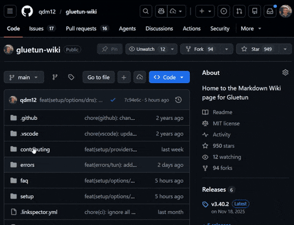

# Gluetun Wiki

👋👋👋

🎊 Welcome to the Gluetun Wiki! 🎊

👋👋👋

🐛 Found a bug in the Wiki?! [Please create an issue](https://github.com/qdm12/gluetun-wiki/issues/new)

❤️😠 help the Gluetun community and fight the AI slop scam website `gluetun[dot]com` by setting `BORINGPOLL_GLUETUNCOM=on` on the latest image. See [setup/others](setup/options/others.md).

💁‍♂️ If you have a Github account, you might want to start Copilot for free to ask your question!

 __

## Table of contents

- [Setup](setup/readme.md#setup) (👋 start here)
  - [Providers](setup/providers/)
  - [Options](setup/options/)
  - [Advanced setup](setup/advanced/)
  - [Popular apps](setup/popular-apps.md)
- [Common errors](errors/)
- [FAQ](faq/)
- [Contributing](contributing/readme.md#contributing)

## Versioning

| Gluetun release tag | Corresponding wiki |
| --- | --- |
| `:latest` | [`main` branch](https://github.com/qdm12/gluetun-wiki) |
| `:v3.40.2` | [`v3.40.2` tag](https://github.com/qdm12/gluetun-wiki/tree/v3.40.2) |
| `:v3.40.1` | [`v3.40.1` tag](https://github.com/qdm12/gluetun-wiki/tree/v3.40.1) |
| `:v3.40.0` | [`v3.40.0` tag](https://github.com/qdm12/gluetun-wiki/tree/v3.40.0) |
| `:v3.39.0` | [`v3.39.0` tag](https://github.com/qdm12/gluetun-wiki/tree/v3.39.0) |
| `:v3.38.0` | [`v3.38.0` tag](https://github.com/qdm12/gluetun-wiki/tree/v3.38.0) |
| `:v3.35.0` | [`v3.35.0` tag](https://github.com/qdm12/gluetun-wiki/tree/v3.35.0) |

The Wiki aims to mirror the release tags of Gluetun, except the Wiki bugfix version number (last number) is for Wiki fixes only.
